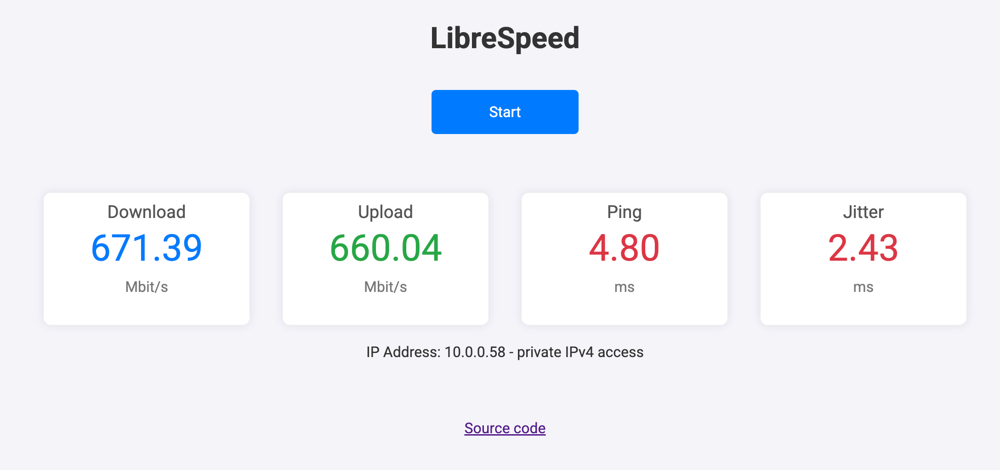

# librespeed/README.md

# Home Assistant Add-on: LibreSpeed

A self-hosted speedtest based on the `linuxserver/librespeed` Docker image.

## About

This add-on allows you to run [LibreSpeed](https://librespeed.org/) within your Home Assistant environment. LibreSpeed is a very lightweight and fast speedtest implemented in JavaScript, using XMLHttpRequest and Web Workers.

This add-on uses the official [linuxserver/librespeed](https://hub.docker.com/r/linuxserver/librespeed) Docker image.

## Installation

1.  Navigate in your Home Assistant frontend to **Settings** -> **Add-ons** -> **Add-on Store**.
2.  Click on the triple-dot menu in the top right and select **Repositories**.
3.  Add the following URL: `https://github.com/el/ha-addons` (or your specific repository URL).
4.  Close the dialog. The "LibreSpeed" add-on should now appear in the store.
5.  Click on "LibreSpeed", then click "Install".
6.  Configure the port mapping if necessary. By default, port `80` on your Home Assistant host is mapped to port `80` of the LibreSpeed container.
7.  Start the add-on.

## Configuration

No specific add-on configuration is required beyond the standard Home Assistant add-on options.

### Port Configuration

The default port for accessing the LibreSpeed web interface is `8080`. You can change this in the "Network" section of the add-on configuration page if `8080` is already in use on your host.

## Basic Usage

Once the add-on is installed and started:

1.  Open your web browser.
2.  Navigate to `http://<your-home-assistant-ip>:8080` (replace `<your-home-assistant-ip>` with the actual IP address of your Home Assistant instance, and `8080` with the host port you configured).
3.  The LibreSpeed interface will load, and you can start a speed test.

## Support

- For issues specifically with this Home Assistant add-on, please open an issue on the [GitHub repository](https://github.com/el/ha-addons/issues).
- For issues related to LibreSpeed itself or the underlying Docker image, please refer to the [LibreSpeed GitHub](https://github.com/librespeed/speedtest) or [LinuxServer.io forums/Discord](https://www.linuxserver.io/support).

## License

This Home Assistant add-on is available under the MIT license. See the [LICENSE](LICENSE) file for details.
LibreSpeed and the linuxserver/librespeed Docker image are distributed under their own respective licenses.
